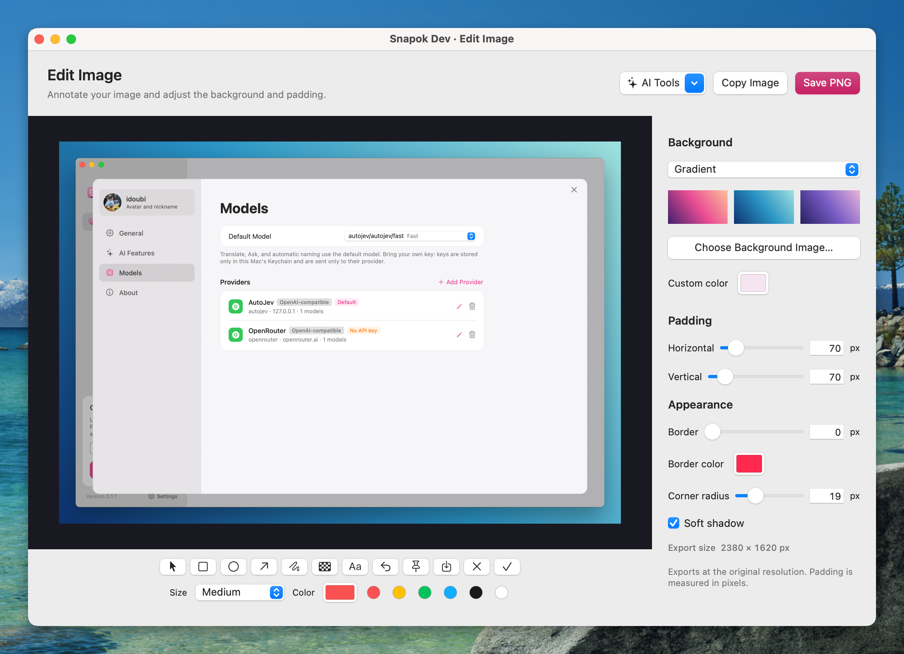
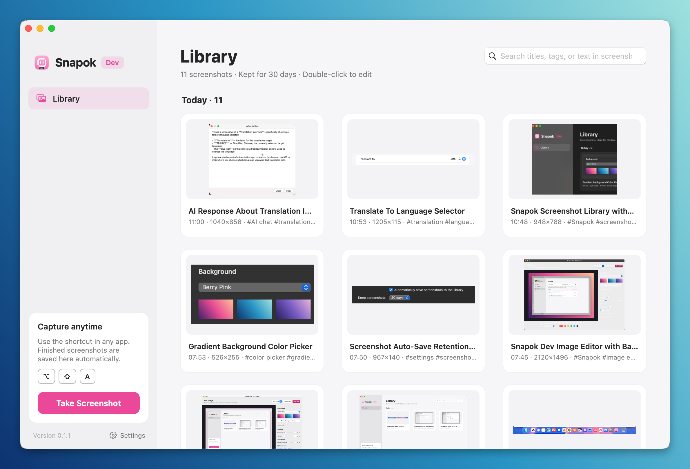
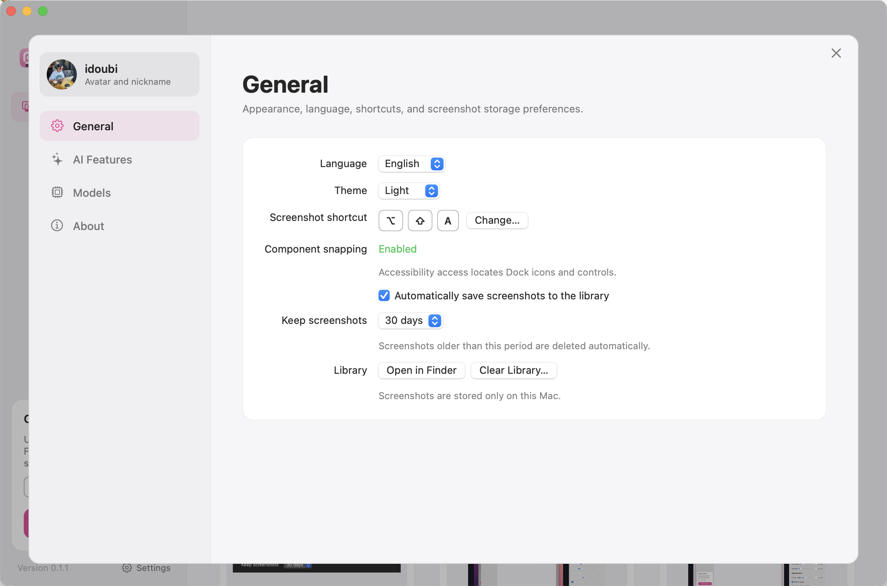

<p align="center">
  
</p>

<h1 align="center">Snapok</h1>
<p align="center">Capture, annotate, and frame screenshots on macOS.</p>
<p align="center"><a href="https://snapok.app">snapok.app</a> · <a href="https://github.com/thinkany-ai/snapok/issues">Report an issue</a></p>

[](https://github.com/thinkany-ai/snapok/actions/workflows/macos.yml)


[](LICENSE)

Snapok is a native screenshot utility built with Swift and AppKit. Its main window is a library of your past screenshots. Close that window to hide the Dock icon; Snapok stays in the menu bar, and the global hotkey keeps working.

> Early development: builds from `dev` are previews, not stable releases. English is the default language; Simplified Chinese is available in Settings → General → Language (applies immediately).

## Features

- **Capture any region:** drag a selection, click a window, or hover over accessible UI components to select them. Detect the Dock, menu bar, and status items as well. Scroll through parent regions; hold Option to select the whole window or system UI container.
- **Customize the selection frame:** choose a color, thickness (1–10 px), and solid, dashed, or dotted borders in Settings → General → Screenshot selection. Preview changes immediately; preferences apply to the next capture and stay out of exported images.
- **Scrolling capture:** capture a long page, chat, or document in one image. Scroll inside the selected area yourself, or let Snapok scroll it; fixed toolbars and input bars appear once.
- **Annotate:** rectangle, ellipse, arrow, pen, text, and mosaic, with adjustable sizes and colors. Move, restyle, delete, and undo annotations.
- **Edit images:** keep annotations editable after capture, add desktop wallpaper, gradients, a solid color, or a custom background image. Zoom with the canvas controls or a trackpad pinch, scroll to move around long images, and use `⌘+` / `⌘−` to zoom or `⌘0` to fit the image to the window.
- **Frame screenshots:** adjust horizontal and vertical padding, border width and color, corner radius, and shadow with a live preview.
  The Gradient background offers six presets and editable start/end colors with an angle from 0–360°. Compact color swatches open an anchored native color popover. Custom gradients are remembered and saved with library entries.
- **Number tutorial steps:** choose **Step Number** (N) in the capture overlay or image editor, then click to place sequential circular numbered markers. Adjust their color and size, move or delete them, and undo placements. Each image starts at 1; reopened images continue from their highest existing step number.
  Choose filled circles, outlined circles, or rounded squares. With the rectangle tool (R), enable **Number boxes** to place an automatic number inside each rectangle's upper-left corner. Numbered boxes and independent markers share one sequence; box numbers move and delete with their box. Both modes preserve number styles in the library.
- **Reuse editing styles:** enable **Use the last image editing style for new screenshots** in General settings to apply the last background, padding, border, corners, and shadow directly when copying, saving, or pinning a capture. This is off by default; annotations are never reused. Library entries retain their own style and editable original.
- **Export:** copy to the clipboard, save PNG, or pin an image above other windows. Export at the original pixel resolution.
- **Inspect pixels:** view cursor coordinates and RGB values in the capture magnifier.
- **Screenshot library:** automatically save finished captures with their annotations, browse them by day, and search by title, tag, or text inside the image. Double-click any screenshot to keep editing it; configure auto-save and retention in Settings.
- **Choose the library folder:** Settings → General → Storage location lets you change where new screenshots are stored. The library displays the selected folder. Enable “Also copy existing screenshots” to bring previous images and editable annotations along; the original folder is preserved either way.
- **Make it yours:** switch between Light, Dark, and System themes, choose English or Simplified Chinese, and customize the capture shortcut in General settings.
- **AI tools:** recognize text and mask phone numbers, emails, ID numbers, and keys on-device; translate a screenshot or ask a question about it with the model of your choice (Anthropic or any OpenAI-compatible provider, with your own key); optionally name and tag new screenshots automatically.

## Install a development build

Download the latest signed development build from **https://cdn.snapok.app/dev/Snapok-Dev.dmg**, open it, and drag **Snapok Dev.app** to **Applications**. It updates itself from then on (see [Updates](#updates)).

Builds of other commits, and pull request builds, are attached to their workflow runs:

1. Open [macOS packages](https://github.com/thinkany-ai/snapok/actions/workflows/macos.yml) and select a successful run for `dev`.
2. Download the **Snapok-macos-&lt;commit&gt;** artifact (GitHub sign-in is required).
3. Extract the artifact, open the `.dmg`, and drag **Snapok Dev.app** to **Applications**. A `.zip` alternative and SHA-256 checksums are included.

Packages are Universal binaries for **Apple Silicon and Intel**, requiring **macOS 14 Sonoma or later**. Artifacts are retained for 30 days. Builds with `unsigned` in the filename have an ad-hoc signature and are **not notarized**; macOS Gatekeeper may block them. Builds without that suffix have passed the configured Developer ID signing and Apple notarization pipeline.

## Permissions

Open **System Settings → Privacy & Security**:

| Permission | Purpose |
| --- | --- |
| Screen Recording / Screen & System Audio Recording | Capture the screen. Required for screenshots. |
| Accessibility | Detect individual controls and panels in other apps, locate the visible Dock on newer macOS versions, and scroll automatically during a scrolling capture. Optional; ordinary window selection, manual capture, and scrolling captures you scroll yourself still work without it. |

Open **Settings → General → Component Snapping** and choose **Enable…** to request Accessibility access. Some apps expose only their containing window or panel; custom-drawn content cannot always be detected as separate components. Dynamic desktop wallpapers may require importing a local background image instead.

## Usage

Press **Control + Command + A** to capture (**Shift + Option + A** in Snapok Dev). Click the highlighted region or drag to create a selection. Use the toolbar to annotate, copy, save, pin, or open **Edit Image**.

| Action | Shortcut / gesture |
| --- | --- |
| Start capture | `⌃⌘A` (Snapok Dev: `⌥⇧A`); change it in Settings → General |
| Select full window | Hold `⌥` while hovering |
| Expand / shrink automatic selection | Scroll up / down |
| Move / resize selection | Drag inside / drag edges or handles |
| Nudge selection | Arrow keys; `Shift` for 10-point steps |
| Edit image | `⌘E` (release) / `⌥E` (development), after selecting a capture |
| Select / move annotations | `V` or the leftmost arrow button in the capture toolbar; click to select, drag to move |
| Rectangle / ellipse / arrow | `R` / `O` / `A` |
| Pen / mosaic / text | `P` / `M` / `T` |
| Small / medium / large stroke or text | `1` / `2` / `3`; `[` / `]` to decrease / increase |
| Pin image | `⌘T` |
| Scrolling capture | Select the area, then click the scrolling capture button or press `⌘L` |
| Copy capture | `Enter`, `⌘C`, or double-click the selection |
| Copy pixel color (HEX) | Hover over the target color before selecting a region, then press `⌘C`; `⌘⌥C` works with or without a selection |
| Copy pixel color (RGB) | `⌘⇧C`, with or without a selection |
| Save PNG | `⌘S` |
| Undo annotation edit | `⌘Z` |
| Delete selected annotation | `Delete` |
| Reselect / cancel capture | Right-click / `Esc` |
| Close image editor | `⌘W` |

Tool shortcuts work after selecting a capture region and in the image editor. They do not switch tools while typing in a text field. During capture or image editing, press `Enter` or `Esc` to finish text input and return to the canvas; then tool shortcuts work again. Hover over a tool to see its shortcut.

### Scrolling capture

Select the area to capture, for example the content of a web page or a chat, then click **Scrolling Capture** in the toolbar. A dashed frame marks the area and a panel beside it shows the image as it grows:

- Scroll down inside the frame with the trackpad or mouse. Scrolling back up is ignored. If you scroll too fast for consecutive frames to overlap, the panel says it lost the position: scroll back up a little until it continues.
- Or click **Scroll Automatically** (requires Accessibility). Snapok scrolls about half the frame at a time and stops at the end of the content.
- Press **Done** (`Return`) to open the result in the image editor, where it is also saved to the library, or **Cancel** (`Esc`).

Rows that stay put while the rest scrolls, such as a toolbar or a message box, are recognized as fixed and appear once, at the top or bottom. Columns that never change, such as a chat list or sidebar inside the selection, are ignored and cropped off the result. Captures stop at 30,000 pixels. Content that changes while you scroll (animations, videos, lazy-loading placeholders) can break the alignment; scroll past it slowly or capture it separately.

### Image editor



Use the lower toolbar to annotate and the sidebar to frame your screenshot. Choose a gradient, desktop wallpaper, solid color, or custom background image; adjust padding (0–600 px per axis), border width (0–20 px) and color, corner radius (0–80 px), and shadow with a live preview. The pointer tool selects and moves annotations. With the text tool, click the image to type directly; press Enter or click outside to finish. Drag existing text to move it, or double-click to edit it in place. Select the text tool or an existing text annotation to choose a font family, size in image pixels (px), and bold styling in the toolbar. Type a pixel size and press Enter or leave the field to apply it. The − / + buttons and scrolling over the number apply changes immediately. The selection border width in General settings uses the same control and supports 1–10 px. Out-of-range input shows the allowed range and the adjusted value. Text styles are preserved when saving, reopening, and exporting screenshots.

Use **Copy Image** or **Save PNG** to export at the original pixel resolution while keeping the editor open. The **AI Tools** menu in the editor header recognizes text, masks sensitive information (undoable), translates, and answers questions about the screenshot.

Pinned images can be dragged, closed with a double-click or `Esc`, and copied or saved from their context menu.

### Screenshot library



Click the Dock icon, or choose **Show Main Window** from the menu bar, to open the main window. Browse screenshots grouped by day, or use the search field to find a capture. The sidebar provides **Library** and **Take Screenshot**, with **Settings** beside the version at the bottom. Close the main window with `⌘W` or the close button to hide the Dock icon while keeping Snapok and its global hotkey running. Choose **Show Main Window** from the menu bar to reopen it and restore the Dock icon.

- With auto-save enabled, copying, saving, pinning, or editing a capture adds it to the library; cancelled captures are not saved.
- Double-click a screenshot (or press `Enter`) to edit it; annotations are written back when the editor closes.
- Right-click for copy, pin, copy recognized text, rename, reveal in Finder, and delete (`Delete` also works).
- Search covers titles, tags, and text recognized on-device after each capture.
- Files live in `~/Library/Application Support/Snapok/History` (`Snapok Dev/History` for development builds), one folder per screenshot (`original.png`, `thumbnail.png`, `meta.json`). Screenshots older than the retention period (default 30 days) are deleted automatically.

### Settings



Open **Settings…** (`⌘,`) or click **Settings** beside the version at the bottom of the library sidebar. Settings opens as a panel over the library; close it with ✕, `Esc`, or a click outside.

- **General:** choose the interface language and theme (**System**, **Light**, or **Dark**), customize the capture shortcut, and check component snapping access. Themes apply immediately and are remembered; System follows the macOS appearance. Control auto-save, choose retention (7/30/90 days or forever), open the library folder in Finder, or clear saved screenshots.
- **Profile:** click the avatar card to set a local avatar and nickname.
- **Models:** configure providers and select the default model for translation, questions, and automatic naming.
- **AI Features:** turn automatic naming on or off. Choose the target language when translating an image.
- **About:** view the version, updates, project links, and library and log locations.

### AI tools

In **Settings → Models**, add providers with an API format (Anthropic Messages or OpenAI-compatible), base URL, API key (stored only in the Keychain), and model IDs. Presets cover Anthropic, OpenAI, OpenRouter, DeepSeek, MiniMax, and Z.AI. Select a default model and test a provider's connection before using it. A key from earlier builds becomes an Anthropic provider automatically.

| Feature | Runs | Needs API key |
| --- | --- | --- |
| Recognize text, search by text | On-device (Vision) | No |
| Mask sensitive information | On-device (Vision + pattern matching) | No |
| Translate image (text-only by default) | Vision OCR + your default text model | Yes |
| Ask about a screenshot | Your default vision model | Yes |
| Auto title and tags (off by default) | Your default model | Yes |

**AI Tools → Translate Image** asks for the target language, recognizes text locally, and sends numbered text blocks to the default model. A text-only model works: image input is off by default. Enable **Use visual context** only with a model that supports images; this also sends the annotated screenshot for OCR correction and context.

The translated image opens in a separate editor. Select a text block to edit its translation, font size, text/fill colors, or box dimensions; drag it to move, disable translation for individual blocks, compare with the original, undo, or reset edits. Copy or save a PNG at the original pixel dimensions. With automatic screenshot saving enabled, translated images also get their own library item; subsequent edits update that item. **Save to Library** also works when automatic saving is off. The source screenshot is preserved. Unchanged text stays intact. Background erasure uses sampled flat colors, not generative inpainting: inspect complex backgrounds and overflowing text before exporting.

Image inputs use the screenshot with its current annotations, so anything already masked stays masked. Automatic naming sends every new screenshot to the API, so it stays off until you enable it.

## Build from source

Requires macOS 14+, Swift 6+, and Xcode Command Line Tools or Xcode. There are no third-party package dependencies. CI uses the `macos-26` runner.

```bash
git clone git@github.com:thinkany-ai/snapok.git
cd snapok
git checkout dev
./scripts/build-app.sh release
open "dist/Snapok Dev.app"
```

While developing, `make dev` builds and launches Snapok Dev, then rebuilds and relaunches it whenever `Sources/`, `Resources/`, or `Package.swift` changes (install `fswatch` for event-based watching instead of polling). For a development executable, use `swift run Snapok`. For a Universal app, use:

```bash
./scripts/build-app.sh release --universal
```

### Development and release channels

Local builds default to the development channel; set `CHANNEL=release` for the release app. The two install side by side and never share data:

| | Development (default) | Release |
| --- | --- | --- |
| Build | `./scripts/build-app.sh release` | `CHANNEL=release ./scripts/build-app.sh release` |
| App | `dist/Snapok Dev.app`, DEV badge on the icon | `dist/Snapok.app` |
| Bundle identifier | `ai.thinkany.snapok.dev` | `ai.thinkany.snapok` |
| Screenshot library | `~/Library/Application Support/Snapok Dev/` | `~/Library/Application Support/Snapok/` |
| Settings / Keychain service | `ai.thinkany.snapok.dev` | `ai.thinkany.snapok` |
| Log | `~/Library/Logs/Snapok Dev.log` | `~/Library/Logs/Snapok.log` |
| Default capture hotkey | `⌥⇧A` | `⌃⌘A` |

The channel is stored as `SnapokChannel` in Info.plist; `swift run` counts as development. Each channel needs its own Screen Recording (and, for component focus, Accessibility) permission. On first launch, the development build moves the library, settings, and API key from pre-rename SnapAny builds into its own storage; the release build starts empty. Builds since 0.1.1 also copy settings and Keychain items from the 0.1.0 identifiers (`ai.snapok.mac`, `ai.snapok.mac.dev`); 0.1.0 installs can't update across the identifier change and need one manual reinstall.

CI builds the development channel for `dev` pushes and pull requests, and the release channel for `v*` tags or a manual run with `channel: release`.

Bundle identifiers stay stable across rebuilds so macOS keeps privacy permissions. `SIGN_IDENTITY=-` forces ad-hoc signing; otherwise a local Apple Development identity is used when available.

### Tests

The standalone Swift checks work with Command Line Tools and do not require XCTest:

```bash
./scripts/test-localization.sh
./scripts/test-focus.sh
./scripts/test-background.sh
./scripts/test-editor.sh
./scripts/test-history.sh
./scripts/test-hotkey.sh
./scripts/test-models.sh
./scripts/test-log-error.sh
./scripts/test-markdown.sh
./scripts/test-image-translation.sh
./scripts/test-image-translation-integration.sh
./scripts/test-updates.sh
./scripts/test-scroll.sh
```

`make test` runs them all.

They cover language defaults and persistence, selection geometry (including system UI), background rendering, Retina annotation coordinates, editing/undo, image export, history storage (in a temporary folder), sensitive-value detection, and on-device text recognition. Cross-application Accessibility behavior, privacy prompts, Dock behavior, and multi-monitor interaction still need manual validation. See [automatic focus notes](docs/automatic-focus.md).

## Automatic macOS packaging

Every push to **`dev`** builds **Snapok Dev** through `.github/workflows/macos.yml`: tests → Universal build → DMG + ZIP + SHA-256 checksums → Actions artifact. Pull requests also build development packages. Version tags (`v*`) build the release channel, **Snapok**. Maintainers can also select either channel when triggering the workflow manually.

The packaging follows the Spotcat project: `lipo` combines both architectures, `ditto` creates ZIPs, and `hdiutil` creates a DMG with an Applications shortcut. If all signing secrets are configured, it also signs with hardened runtime, notarizes and staples the app and DMG, and verifies them with Gatekeeper.

| GitHub Actions secret | Value |
| --- | --- |
| `APPLE_CERTIFICATE` | Base64-encoded Developer ID Application `.p12`, including the private key |
| `APPLE_CERTIFICATE_PASSWORD` | Password protecting the `.p12` |
| `APPLE_SIGNING_IDENTITY` | Developer ID Application identity name |
| `APPLE_ID` | Apple account used for notarization |
| `APPLE_PASSWORD` | Apple app-specific password |
| `APPLE_TEAM_ID` | Apple Developer team ID |

Configure them on **this repository** under Settings → Secrets and variables → Actions. Secrets cannot be read back or automatically copied from another repository. The setup helper uses the same variable names as Spotcat:

```bash
# Set the four APPLE_* identity/notarization variables in your local environment first.
# The helper prompts for the certificate password, or reads APPLE_CERTIFICATE_PASSWORD.
./scripts/setup-release-secrets.sh /path/to/DeveloperID.p12
```

Do not commit certificates, private keys, passwords, or `.env` files. Without a certificate, CI still produces clearly labeled unsigned development packages; an incomplete signing configuration fails rather than claiming a signed release.

Local packaging:

```bash
./scripts/package-macos.sh --unsigned
# Requires Developer ID in the keychain and the four APPLE_* variables:
./scripts/package-macos.sh --signed
```

Outputs are in `dist/archives/`. `PACKAGE_SUFFIX` controls the filename suffix and `BUILD_NUMBER` overrides the bundled build number. The workflow uploads artifacts and, for signed pushes, publishes to the CDN below; it does not create a GitHub Release.

## Updates

Signed builds from pushes are published to **https://cdn.snapok.app** (R2 bucket `snapok`) by `scripts/publish-cdn.sh`:

| Channel | Trigger | Manifest | Stable download |
| --- | --- | --- | --- |
| Snapok Dev | push to `dev` | `dev/latest.json` | `dev/Snapok-Dev.dmg` |
| Snapok | `v*` tag matching Info.plist | `latest.json` | `Snapok.dmg` |

Versioned packages are uploaded first and `latest.json` last, and the feed never moves to an older build. Release prereleases (`v1.2.0-beta.1`) upload packages without changing `latest.json`. Release notes come from the annotated tag message; development notes are the commit subject.

The app checks its channel's manifest 10 seconds after launch and every 6 hours (Settings → About → Updates, or *Check for Updates…* in the app and menu bar menus). It installs only after the ZIP matches the manifest's SHA-256 and the new app has the same bundle ID and version and is signed by the same Developer ID team, then replaces itself and relaunches. Local and ad-hoc builds are not Developer ID signed and never update.

## Privacy and telemetry

Builds published by this repository send anonymous usage events to PostHog (launches, finished captures and their action, AI features used, installed updates) and crash reports to Sentry. Each install has a random ID; nothing includes screenshots, recognized text, file names, prompts, or keys, and PostHog events create no person profiles. Turn it off in Settings → About → Privacy.

The keys are not in the source. `scripts/build-app.sh` writes `POSTHOG_PROJECT_KEY` (and optionally `POSTHOG_HOST`) and `SENTRY_DSN` from the environment into Info.plist, and only this repository's Actions builds set them from secrets, so builds from source and forks never report. Reporting also requires a Developer ID signature. An optional `SENTRY_AUTH_TOKEN` secret uploads debug symbols so crash reports show source lines.

CI uploads through the `snapok-cdn-upload` Worker (`cdn/`), which holds the bucket binding, using the `CDN_UPLOAD_TOKEN` secret, so the repository has no Cloudflare credentials. Without that secret, packaging still succeeds and the feed is left unchanged. To publish by hand with a local `wrangler` login: `CHANNEL=dev ./scripts/publish-cdn.sh dist/archives/<name>.dmg dist/archives/<name>.zip`.

## Contributing

Issues and pull requests are welcome. Branch from `dev`, keep changes focused, describe how to reproduce a bug, and run the relevant checks before submitting. For UI changes, include before/after screenshots and test at the minimum window size. Never include private screenshots or signing credentials in reports.

Source lives in `Sources/Snapok`, checks in `Tests/SnapokTests`, and build helpers in `scripts`. The current app icon can be regenerated with `scripts/render-icon.swift`; generated iconsets and earlier design drafts are excluded from Git.

## Language

Snapok starts in English by default. Choose **Settings → General → Language → 简体中文** to use Simplified Chinese. The choice is saved and applies immediately, without restarting, to menus, the library, settings, and every capture or editor opened afterwards; image editors and pinned images that are already open keep their language until reopened. AI answers and newly generated titles follow the app language; existing titles and the separate translation target are preserved.

## License

Snapok is licensed under [AGPL-3.0](LICENSE) © 2026 ThinkAny, LLC. A commercial license without
the AGPL's copyleft obligations is available — contact support@thinkany.ai.
